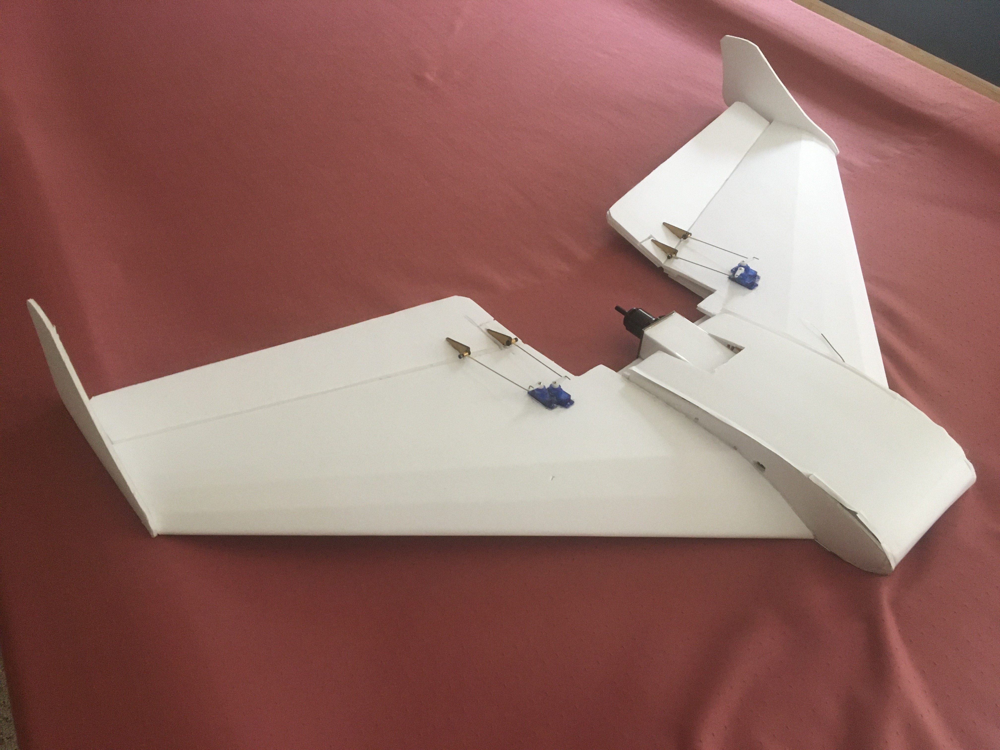
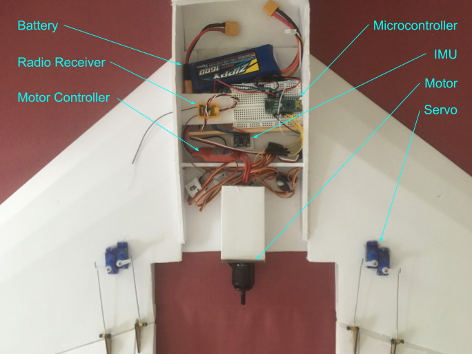
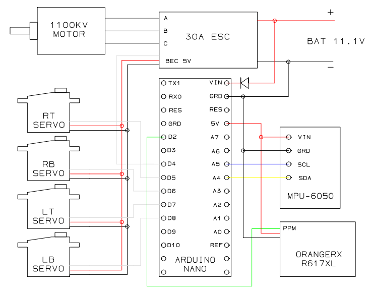

# About

An Arduino-based flight controller for radio-controlled aircraft designed from
scratch using accessible and inexpensive hardware.

Flying wings are notoriously difficult to fly because of their aerodynamic
instability. The flight controller adds self-leveling features including
autonomous cruise, takeoff, and landing that make the aircraft more stable and
easier to fly.

# The Aircraft

The aircraft is a modified
[FT Spear](https://s3.amazonaws.com/plans.flitetest.com/stonekap/FT_Spear_v1.0_Tiled.pdf)
designed by [Flite Test](https://www.flitetest.com/). It is made out of
accessible materials including foam board, plywood, and hot glue. 

# Electrical System

At the center of the electrical system is an Arduino Nano microcontroller.
It performs all the computation required to fly the aircraft. The
microcontroller calculates the aircraft's orientation using data from the IMU's
gyroscope and accelerometer. It also processes signals from the radio receiver
to obtain the pilot's inputs. The microcontoller uses both the pilot's inputs
and the aircraft's current orientation to command the servo motors. The servo
motors change the shape of the wing, changing the aircraft's orientation. The
lithium polymer battery can power the airplane for up to 10 minutes in flight.

# Software and Controls

The flight controller uses 2 PID controllers to fly the aircraft. One PID
controller handles the aircraft's pitch and the other controller handles the
aircraft's roll. The difference between the current roll/pitch angles and the
target angles is called error. The PID controllers compute an output signal for
the servo motors based on the error. The target angles are normally set to 0 so
the aircraft flies level. Pilot input moves the target angles allowing the
pilot to manuever the aircraft. When the pilot stops giving input, the aircraft
returns to level flight.

The flight controller has three modes:
- pass-through -- pilot has direct control of servo motors
- auto-level -- PID ctrl enabled, target roll and pitch set to 0, for
autonomous cruise and landing 
- auto-climb -- PID ctrl enabled, target roll set to 0, target pitch set to
+15, for autonomous takeoff

The pilot can quickly change between the three modes using a switch on the
radio transmitter. 
